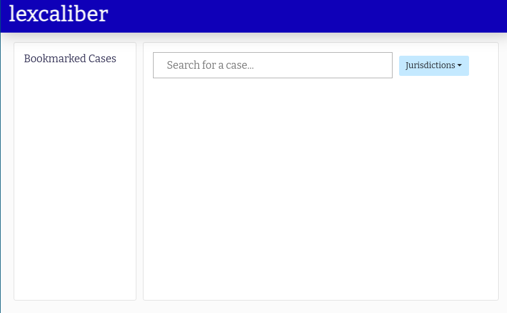
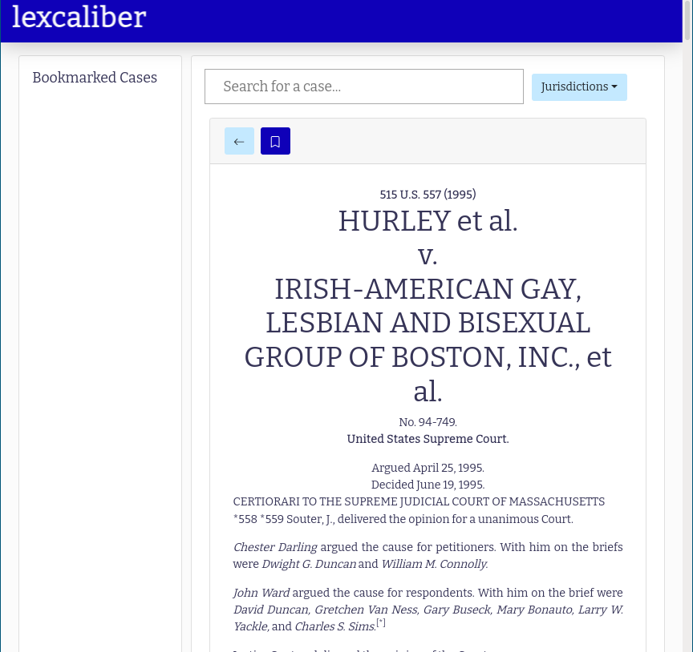
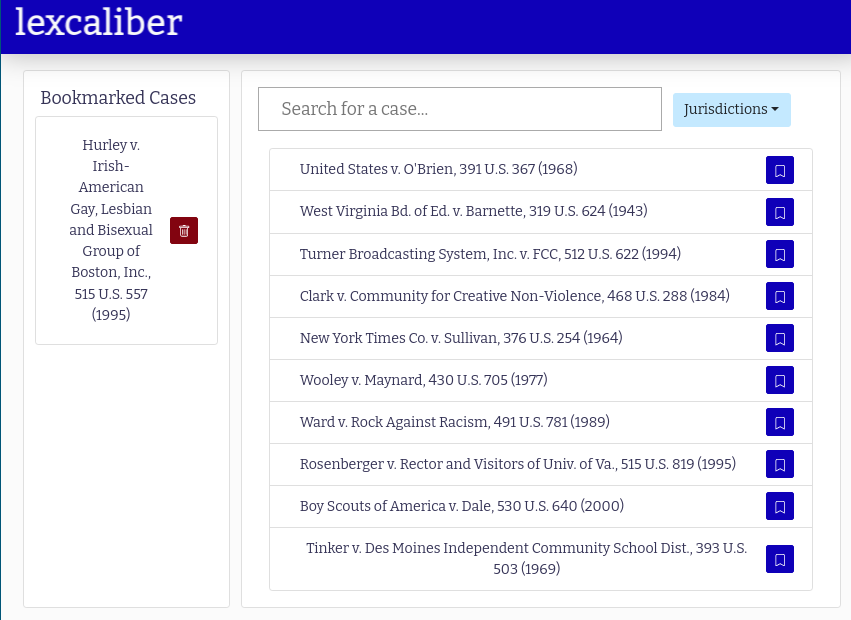
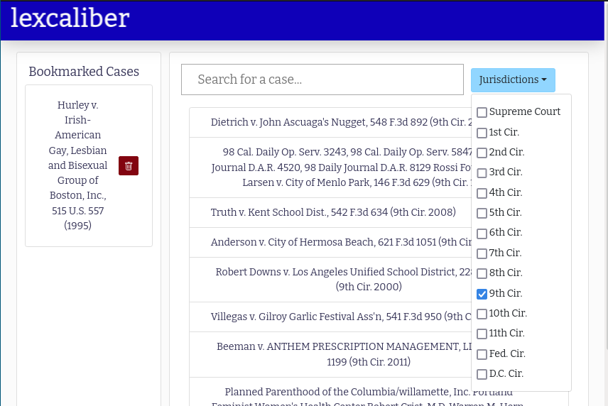
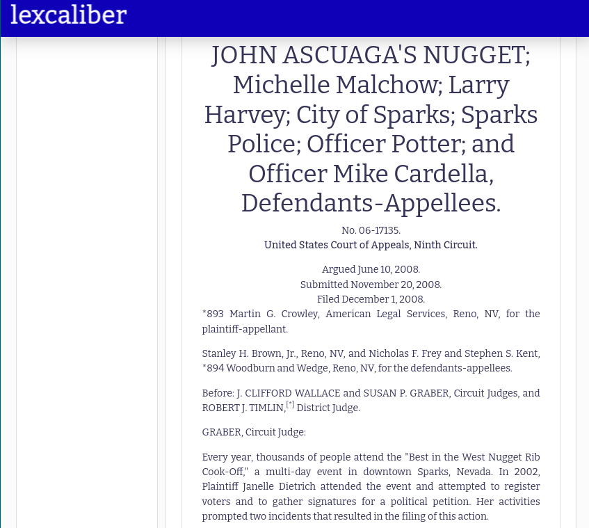

# Lexcaliber Explorer

Lexcaliber is an ongoing project to develop novel algorithms and analysis techniques for legal research.
The [Lexcaliber Core](https://github.com/lexcaliber/core) repository showcases a variety of novel techniques in legal document analysis, including legal recommendation & discovery software, citation context scraping & analysis, and relevant scaffolding.

The Lexcaliber Explorer (Lexplorer?) is a companion to the Core which is intended to provide a web-based frontend which can demonstrate some of the Core’s functionality.

Currently, the Explorer focuses on legal recommendation.
Users of Explorer can search for opinions from the Supreme Court and Federal Circuit courts and bookmark relevant documents.
New, relevant cases will be suggested based on bookmarked cases.

Recommendations can also be filtered by jurisdiction.
This is handy if, for example, you know about a few relevant cases in the 10th Circuit but want to know what the analogous precedent would be in the 1st Circuit.
We’ve anecdotally tested this out with circuit splits; and given one end of a circuit split and a filter to the right jurisdiction, the recommendation engine consistently returns the splitting case as the top result.

## Images

## Install and Run

1. Follow the instructions for running and starting the Lexcaliber Core server locally.
2. Make sure you have `yarn`.
3. Clone the repo and run `yarn` followed by `yarn start`.

